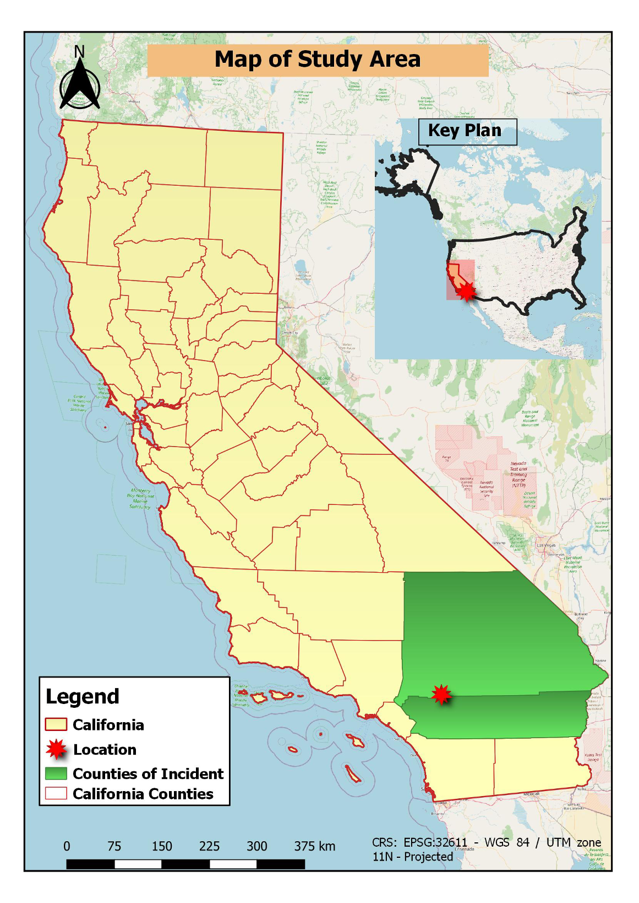
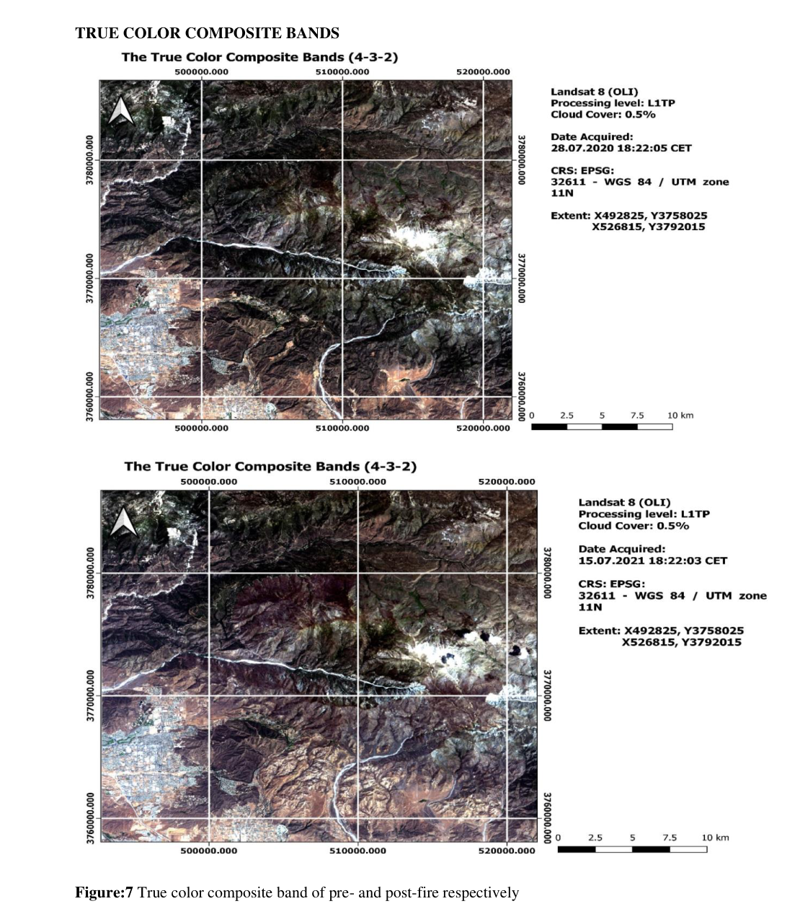
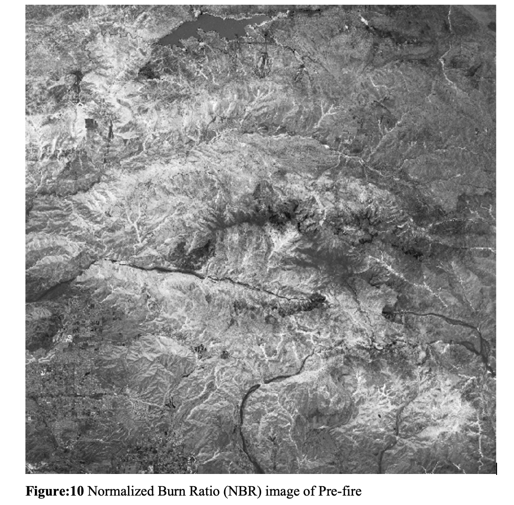
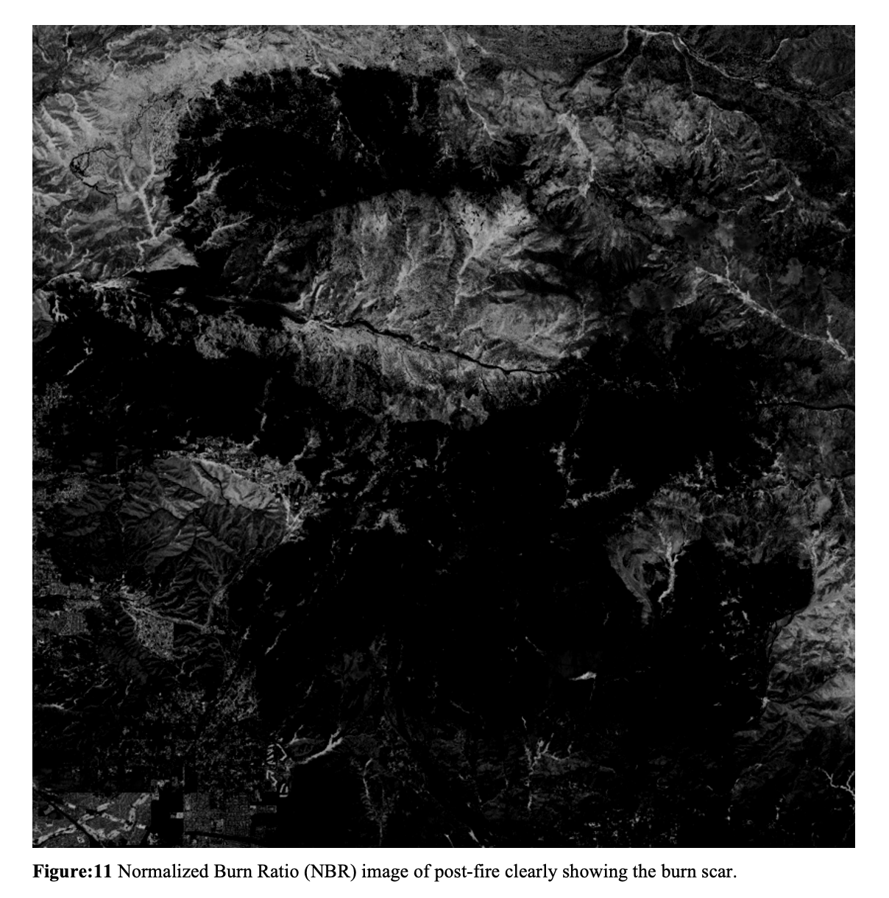
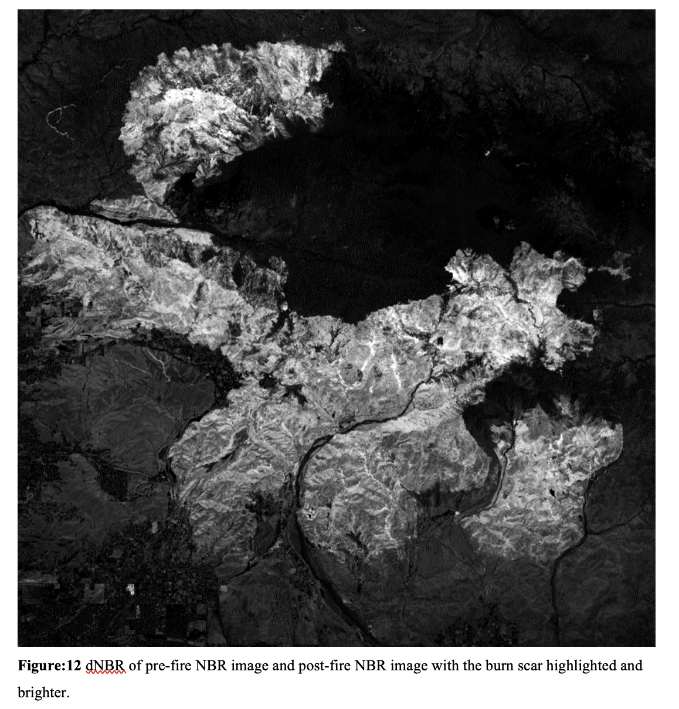
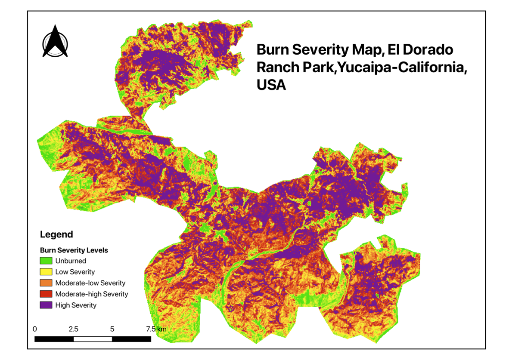

# Burn Severity Analysis Using Landsat 8

## Overview

This project documents a **QGIS-based remote-sensing workflow** for assessing post-fire burn severity in the El Dorado Ranch Park/Yucaipa area of California, USA.

The analysis uses **Landsat 8 Operational Land Imager (OLI)** imagery from before and after the 2020 fire event. The workflow derives the **Normalized Burn Ratio (NBR)**, calculates **delta NBR (dNBR)**, classifies burn severity using the documented USGS severity ranges, and calculates the area represented by each class.

The original analysis was performed in **QGIS**, using the **Semi-Automatic Classification Plugin (SCP)**. No Python analysis scripts were used in the original project.

## Project details

- **Study location:** El Dorado Ranch Park / Yucaipa, California, USA
- **Satellite:** Landsat 8 OLI
- **Pre-fire acquisition:** 28 July 2020
- **Post-fire acquisition:** 15 July 2021
- **CRS:** EPSG:32611 — WGS 84 / UTM Zone 11N
- **Software:** QGIS
- **Plugin:** Semi-Automatic Classification Plugin (SCP)
- **Atmospheric correction:** DOS1
- **Primary index:** Normalized Burn Ratio (NBR)
- **Change metric:** delta NBR (dNBR)
- **Classification:** USGS burn-severity ranges

## Workflow

```text
Landsat 8 OLI
      │
      ├── Pre-fire image
      └── Post-fire image
              │
              ▼
      DOS1 atmospheric correction
              │
              ▼
       Clip to study area
              │
              ▼
       NIR + SWIR2 bands
              │
              ▼
          NBR images
              │
              ▼
       dNBR = pre-NBR − post-NBR
              │
              ▼
    USGS severity classification
              │
              ▼
       Area calculation
              │
              ▼
      Burn-severity map
```

## Selected outputs

### Study area



### Pre-fire and post-fire imagery



### NBR analysis





### Delta NBR



### Burn-severity classification



## Spectral analysis

NBR was calculated using:

**NBR = (NIR − SWIR2) / (NIR + SWIR2)**

The report used Landsat 8 **Band 5 (NIR)** and **Band 7 (SWIR2)**.

The change metric was:

**dNBR = pre-fire NBR − post-fire NBR**

Higher positive dNBR values indicate greater post-fire spectral change; negative values can indicate regrowth.

## Burn-severity classes

The documented classification contains:

- Enhanced Regrowth, high
- Enhanced Regrowth, low
- Unburned
- Low Severity
- Moderate-low Severity
- Moderate-high Severity
- High Severity

## Area assessment

The report's area assessment covers **51,963.66 ha**. However, **28,764.45 ha (55.35%) is recorded as no data**, so the total AOI should not be interpreted as fully classified.

| Class | Area (ha) | Percentage of total area |
|---|---:|---:|
| Enhanced Regrowth, high | 0.36 | 0.00% |
| Enhanced Regrowth, low | 1,236.51 | 2.38% |
| Unburned | 19.62 | 0.04% |
| Low Severity | 4,369.77 | 8.41% |
| Moderate-low Severity | 6,409.17 | 12.33% |
| Moderate-high Severity | 7,541.37 | 14.51% |
| High Severity | 3,622.41 | 6.97% |
| No data | 28,764.45 | 55.35% |

## Interpretation and limitation

The final burn-severity product should be treated as a **preliminary remote-sensing classification**, not a field-validated soil burn-severity map. The original report explicitly notes that field investigation is required to verify and refine severity because satellite imagery alone cannot observe all ground and soil conditions.

The detailed mapping workflow and final map are labelled for **El Dorado Ranch Park, Yucaipa, California**. Although the report discusses both the El Dorado and Apple fire incidents, this portfolio repository does not claim that two separate fire maps were independently produced.

## Portfolio relevance

This project demonstrates practical experience with:

- QGIS
- Landsat 8 OLI
- Raster preprocessing
- Atmospheric correction
- Spectral indices
- NBR and dNBR
- Raster calculation and reclassification
- Burn-severity mapping
- Area statistics
- GIS cartography
- Remote-sensing interpretation

It also provides the foundation for the later Sentinel-1/Sentinel-2 time-series and SAR machine-learning projects in the portfolio.
